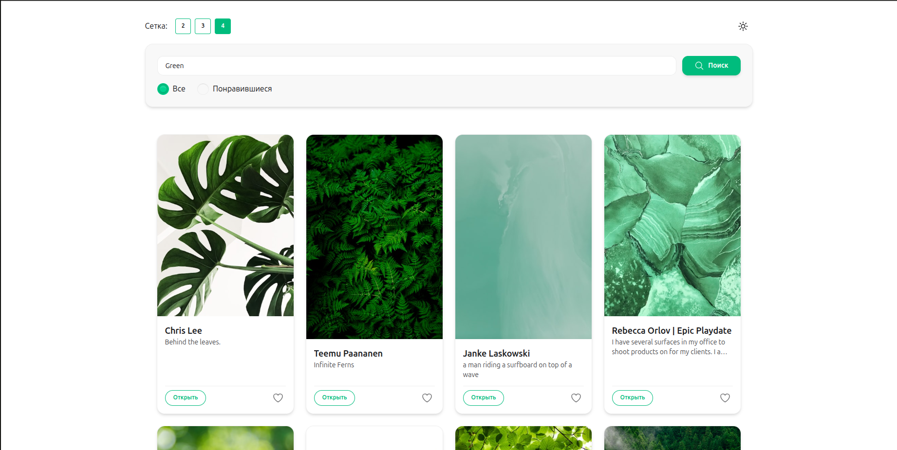

# Unsplash Vue Gallery 🌄

[](https://unsplash-vue-gallery-rwqt.vercel.app/)

A responsive image gallery powered by Vue 3 and Unsplash API. Features infinite scroll, theme switching, and local favorites.



## ✨ Core Features

- **🌗 Smart Theme System** — Auto-saves preference (light/dark)
- **💖 Persistent Likes** — LocalStorage favorites management
- **📸 Instant Search** — Real-time Unsplash API integration
- **♾️ Seamless Pagination** — Infinite scroll with error handling
- **📱 Adaptive Grid** — Responsive column layout (1-4 cols)
- **🔍 Search Filters** — Toggle between all/liked images

## 🚀 Quick Deployment

### Local Setup

```bash
git clone https://github.com/LIGECT/unsplash-vue-gallery.git
cd my-gallery
npm install
npm run dev
```

### Configuration

1. Create `.env` file in root directory:

```env
VITE_UNSPLASH_ACCESS_KEY=your_api_key_here
```

2. Update API configuration in `src/api/unsplash.js`:

```js
const API_KEY = import.meta.env.VITE_UNSPLASH_ACCESS_KEY;
```

## 🏗 Project Structure

```plaintext
my-gallery/
├── src/
│   ├── api/                  # Unsplash API client
│   ├── components/           # Vue components (SearchBar, ImageList, ImageCard)
│   ├── composables/          # Composition API logic
│   │   ├── useTheme.js       # Light/dark theme manager
│   │   ├── useColumnCount.js # Responsive grid columns
│   │   └── useImageSearch.js # Search/pagination logic
│   ├── App.vue               # Root component
│   └── main.js               # Vue initialization
├── public/                   # Static assets
├── vite.config.js            # Vite configuration
└── package.json              # Project dependencies
```

## 📌 Requirements

- Node.js v18+
- Modern browser (Chrome/Edge/Firefox)
- Internet connection
